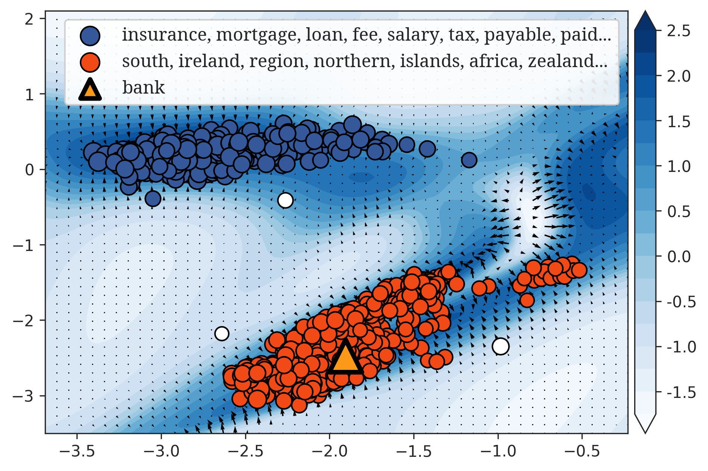
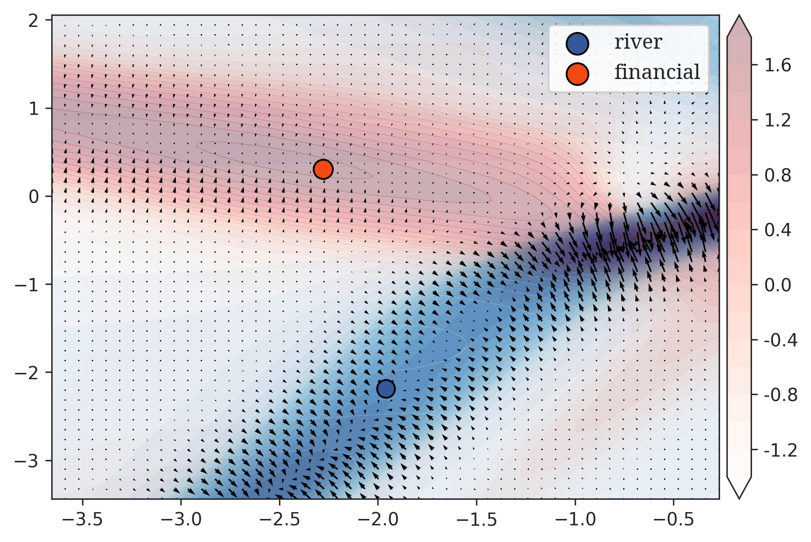

# FIRELANG

This repository holds the code for the
[paper](https://www.cl.rcast.u-tokyo.ac.jp/~duxin/files/neurips2022fire.pdf):
- Xin Du and Kumiko Tanaka-Ishii. "Semantic Field of Words Represented as Nonlinear Functions", NeurIPS 2022.

We proposed a new word representation in a functional space rather than a vector
space, called FIeld REpresentation (FIRE). Each word $w$ is represented by a
pair $[\mu, f]$, where $\mu$ is one or multiple locations, represented with a
measure; $f: [-4,4]^2\to \mathbb{R}$ is a nonlinear function implemented by an
individual small neural network for each word.  The similarity between two words
is thus computed by a mutual integral between the words:

$$
\mathrm{sim}(w_1,w_2) = \int f_1~\mathrm{d}\mu_2 + \int f_2~\mathbb{d}\mu_1.
$$

FIRE represents word polysemy by the multimodality of $f$ and by the multiple
locations of $\mu$; at the same time, FIRE preserves additive compositionality
of semantics, which is represented as functional addition:

$$ w_1+w_2 = [\mu_1+\mu_2, f_1+f_2]. $$

The similarity between two sentences $\Gamma_1$ and
$\Gamma_2$ is thus computed with the word similarity between the words:

$$ \mathrm{sim}(\Gamma_1, \Gamma_2) = \gamma_1^\mathrm{T} \Sigma \gamma_2, $$

where $\gamma_1$ and $\gamma_2$ are weights assigned to the words in sentence 1 and 2,
respectively; $\Sigma$ is the word similarity matrix: $\Sigma_{ij} = \mathrm{sim}(w_i, w_j)$.

<figure align="center">

<figcaption>
Words that are frequent and similar to the word `bank`, visualized in the semantic field of `bank`
</figcaption>
</figure>

<figure align=center>

<figcaption>
Overlapped semantic fields of `river` and `financial`, and their locations. The shape resembles that of `bank` in the image above, indicating FIRE's property of compositionality.
</figcaption>
</figure>

# Parallelization of neural networks
A challenge for implementing FIRE is to parallize
the evaluation of functions $f$ with separate inputs.

The usual way of using a neural network NN is to process a data batch at a time,
that is the parallelization of $\text{NN}(x_1)$, $\text{NN}(x_2)$...  Recent
advances in deep learning packages provide a new paradigm of parallelize the
computation of $\text{NN}_1(x)$, $\text{NN}_2(x)$...  such as the
[vmap](https://pytorch.org/tutorials/prototype/vmap_recipe.html) method in JAX
and PyTorch.

In FIRE-based language models, we instead require the parallelization of both
neural networks and data.  The desired behavior should include:
- plain mode: $\text{NN}_1(x_1)$, $\text{NN}_2(x_2)$...
- cross mode:
  - $\text{NN}_1(x_1)$, $\text{NN}_1(x_2)$...
  - $\text{NN}_2(x_1)$, $\text{NN}_2(x_2)$...
  - $\cdots$

In other words, the separate neural networks must be batchified, just as the
indexing of column vectors in a matrix and the recombination of them into a new
matrix.  We call this process a "stacking and slicing".  We provide one solution
in this repository. Please see the [`StackSlicing`]() class.

# WordNet-542 dataset
We selected a [subset](/data/wordnet-542.txt) of the ["Core"
WordNet](https://wordnet.princeton.edu/download/standoff-files) dataset and
constructed a list of 542 strongly polysemeous / strongly monosemeous words.
See `/data/wordnet-542.txt`
